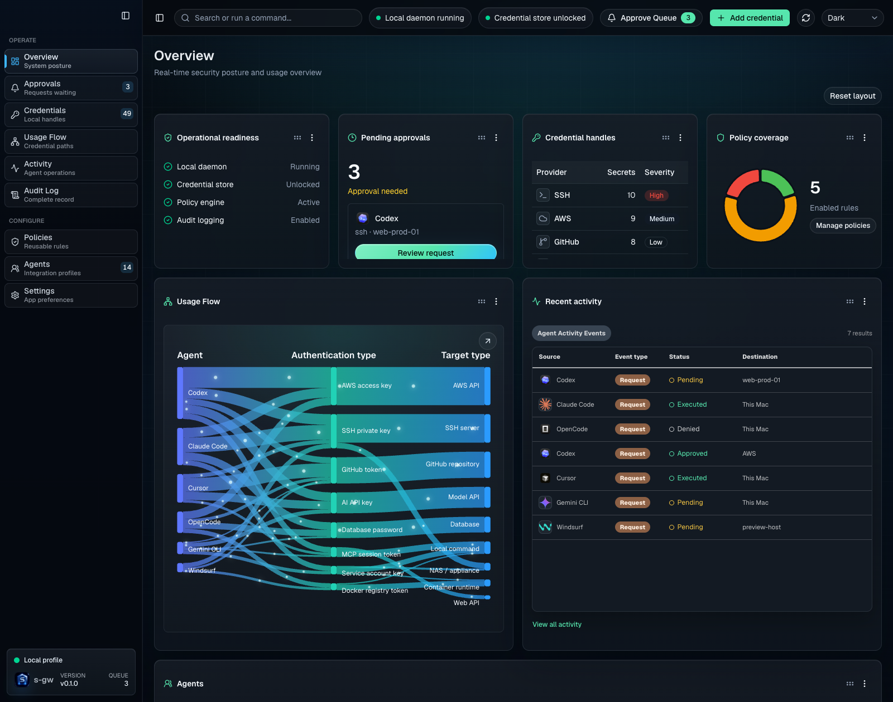
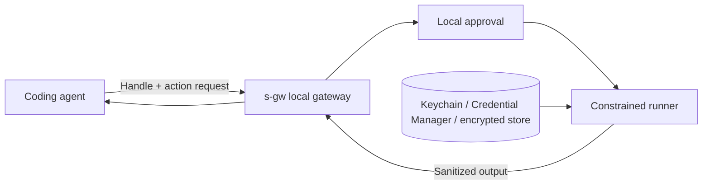

<p align="center">
  
</p>

<h1 align="center">s-gw</h1>

<p align="center">
  <strong>Local credential control for coding agents.</strong><br>
  Approve bounded actions locally. Keep raw credentials out of model context and tool output.
</p>

<p align="center">
  <a href="https://github.com/sgateway/s-gw/actions/workflows/ci.yml"></a>
  <a href="https://www.npmjs.com/package/@s-gw/s-gw"></a>
  <a href="LICENSE"></a>
  
  <a href="https://s-gw.com"></a>
  <a href="https://github.com/sgateway/s-gw/stargazers"></a>
  
</p>

<p align="center">
  <a href="https://s-gw.com">Demo</a> ·
  <a href="https://github.com/sgateway/s-gw/releases">Downloads</a> ·
  <a href="#quick-start">Quick start</a> ·
  <a href="docs/README.md">Documentation</a> ·
  <a href="SECURITY.md">Security</a> ·
  <a href="CONTRIBUTING.md">Contributing</a>
</p>

[](https://s-gw.com)

Stop handing raw credentials to coding agents. s-gw gives agents typed handles, asks you to approve bounded local actions, resolves the credential inside a constrained process on your machine, and returns sanitized output instead of secret values.

> [!IMPORTANT]
> s-gw is an early preview. Storage formats and interfaces may change, Windows support is still experimental, and the project has not completed an independent security audit. Do not treat it as a replacement for endpoint security or a hardened enterprise secrets platform yet.
>
> The TypeScript broker, clients, and documentation in this repository are Apache-2.0 licensed. Distributed packages also contain a proprietary compiled Rust execution core whose source is maintained separately.

## The Short Version

- **Agent sees:** `s-gw:credential:prod-readonly`
- **You approve:** agent, command, handle, environment binding, working directory, and target
- **s-gw runs:** the command locally with the credential injected only into that child process
- **Agent receives:** sanitized output, audit evidence, and no raw secret

If s-gw helps your agent workflow, [star the project](https://github.com/sgateway/s-gw/stargazers). It makes the preview easier for other developers to find.

## See It In Action

The local console shows the approval queue, credential inventory, policy state, usage flow, and activity history without exposing secret values.


Public demo: [s-gw.com](https://s-gw.com).

## What It Does

| Govern | Approve | Execute | Audit |
| --- | --- | --- | --- |
| Turn secrets into typed local handles that agents can reference safely. | Review the requesting agent, handle, command, environment binding, working directory, and target before access is granted. | Inject the credential only into the approved child process on the same machine. | Record request, approval, execution, policy, and destination evidence without storing returned raw secrets. |

## Why Teams Use It

- **Local custody:** raw values stay in macOS Keychain, Windows Credential Manager, 1Password, or the encrypted local ledger.
- **Action-scoped access:** grants bind to the agent, handle, command, environment variable, working directory, target, approval mode, and optional time window.
- **Useful handles:** agents can request real work with stable handle names instead of seeing keys, passwords, tokens, or SSH material.
- **Output sanitization:** command output is scanned before it returns to the agent, replacing detected credential values with handles.
- **Agent-aware setup:** Codex, Claude Code, Cursor, OpenCode, Gemini CLI, GitHub Copilot, VS Code, and other MCP clients get profile-specific configuration.
- **Local operator UI:** the macOS app, menu helper, CLI, and web console show approvals, credential inventory, policies, usage flow, activity, and audit history.

## How It Works



The agent never needs the unlock passphrase or raw credential. Approval is scoped to the requested operation rather than granting general access to the store.

## Core Surfaces

| Surface | Purpose |
| --- | --- |
| `s-gw` CLI | Setup, credential enrollment, approvals, policies, agent snippets, guard mode, and diagnostics. |
| `s-gw-mcp` / `s-gw mcp` | Stdio MCP server for agent-facing handle discovery and request creation. |
| Native macOS app | Approval queue, credential inventory, policy rules, usage flow, activity, and audit review. |
| Menu-bar helper | Fast visibility into pending approvals and local daemon status. |
| Local web console | Browser-accessible fallback UI bound to `127.0.0.1`. |
| Guard mode | Launch agents with credential-looking environment values replaced by s-gw handles. |

## Quick Start

Requirements: Node.js 20 or newer.

```bash
npm install -g @s-gw/s-gw
s-gw setup
s-gw status
```

The public source builds the TypeScript compatibility path. Building the native macOS surfaces also requires a Swift toolchain. Maintainer release builds additionally require access to the private Rust core checkout.

Preview desktop builds are available from [GitHub Releases](https://github.com/sgateway/s-gw/releases). The current macOS and Windows downloads are unsigned preview artifacts. The npm package is the recommended installation path. It includes the native app, menu helper, Keychain helper, metadata-only Keychain inspector, and Rust core for Apple Silicon Macs; Linux and Windows use the TypeScript execution path when a matching native core is not packaged. Intel Macs must build the native Keychain and desktop surfaces from source for now; the npm package and DMG reject their arm64-only helpers with a clear compatibility error.

```bash
git clone https://github.com/sgateway/s-gw.git
cd s-gw
npm ci
npm run build
npm link
s-gw setup
s-gw status
```

`s-gw setup` generates local unlock material, stores it in the operating system credential store, initializes the encrypted ledger, starts the local UI surfaces available on the current platform, and safely connects detected supported agents. On macOS it installs `s-gw.app` in `/Applications`, falling back to `~/Applications` when needed. It backs up existing agent config, preserves unrelated settings, installs the packaged s-gw skill where supported, and reports per-agent conflicts. Use `--no-agents` to skip agent registration.

Add a credential from your terminal without placing the value in chat or a process argument:

```bash
printf '%s' "$MY_API_TOKEN" | s-gw secret add-keychain \
  --name demo-token \
  --type api-token \
  --value-stdin \
  --inject-env API_TOKEN \
  --allow-command "$(command -v printenv)"
```

Then inspect the non-secret handle metadata:

```bash
s-gw secret list
```

The [end-to-end trust loop](docs/quickstart.md) walks through a disposable request, local approval, execution, and output sanitization without touching a real credential.

## Try The Trust Loop

Use a disposable local token to see the full flow:

```bash
printf '%s' 'demo-secret-value' | s-gw secret add-keychain \
  --name demo-printenv-token \
  --type api-token \
  --value-stdin \
  --inject-env DEMO_TOKEN \
  --allow-command "$(command -v printenv)"

s-gw request env-command <returned-handle> \
  --command "$(command -v printenv)" \
  --inject-env DEMO_TOKEN

s-gw approve <request-id>
s-gw execute <request-id>
```

The execution output should show a handle token instead of `demo-secret-value`.

## Agent Integration

List the known agent profiles and render the configuration for one client:

```bash
s-gw agent list
s-gw agent mcp-snippet codex
s-gw agent mcp-snippet claude-code
s-gw agent mcp-snippet opencode
```

Review or manage detected connections:

```bash
s-gw agent status
s-gw agent install codex --dry-run
s-gw agent install codex
s-gw agent uninstall codex
```

Manual profiles and config formats without a safe merge path continue to use the generated snippet. npm installation itself never edits agent configuration.

`s-gw setup` can safely manage detected Claude Code, Codex, Cursor, Gemini CLI, GitHub Copilot CLI, OpenCode, and default-profile VS Code installations on macOS, Windows, and Linux. On Windows, it launches the packaged MCP server through `node.exe`, not an npm `.cmd` shim.

For CLI agents, guard mode can replace credential-looking launch environment values with s-gw handles before the agent starts:

```bash
s-gw run codex --dry-run -- -v
s-gw run codex -- --ask-for-approval never
```

MCP registration does not intercept every prompt, file read, shell, or environment variable. See [agent integration](docs/integrations.md) and the [agent profile matrix](docs/agents.md) for the supported paths and current limitations.

## Example Request Flow

1. An agent sees `s-gw:credential:prod-readonly` and asks to run `aws sts get-caller-identity`.
2. s-gw creates a pending request with the agent name, command, handle, environment binding, working directory, target, and policy result.
3. You approve once, for a time window, for the login session, or deny it.
4. s-gw starts the approved local process with the credential injected into the requested environment variable.
5. s-gw scans the process output before it returns to the agent.

The model can complete the task without receiving the raw access key.

## Platform Status

| Platform | Status | Credential store | User interface |
| --- | --- | --- | --- |
| macOS 14+ on Apple Silicon | Primary development platform | Keychain | Native app, menu helper, local web console |
| macOS 14+ on Intel | Build-from-source candidate; not QA-tested | Source-built Keychain helper | Source-built native surfaces or local web console |
| Windows 10/11 | Preview | Credential Manager | PowerShell client, tray helper, local web console |
| Linux | Experimental CLI | Environment-provided unlock material | Local web console |

Preview installers are available from [GitHub Releases](https://github.com/sgateway/s-gw/releases). The Apple Silicon macOS DMG is ad-hoc signed and unnotarized, and the Windows package is unsigned preview software. Build the same artifacts locally with `npm run build:installers`.

## Security Model

s-gw is designed to reduce accidental credential exposure to coding agents. It does not protect against a compromised operating system account, a malicious approved executable, screen capture, kernel-level access, or every transformed derivative of a secret.

Read the [threat model](docs/threat-model.md) before relying on s-gw for sensitive workflows. Report suspected vulnerabilities through [GitHub private vulnerability reporting](SECURITY.md), not a public issue.

## Project Status

- The public broker and client source distribution is preview quality; the compiled Rust execution core is proprietary.
- macOS is the primary development and test platform.
- Windows Credential Manager support is present but still needs broader native QA.
- Linux currently depends on environment-provided unlock material.
- Desktop preview downloads are unsigned and intended for evaluation.
- The repository is prepared for open-source collaboration, but security-sensitive changes should come with focused tests and threat-model updates when behavior changes.

## Documentation

- [Documentation index](docs/README.md)
- [Quick start and trust-loop demo](docs/quickstart.md)
- [Architecture](docs/architecture.md)
- [Threat model](docs/threat-model.md)
- [Agent integrations](docs/integrations.md)
- [Credential stores and 1Password](docs/keychain.md)
- [Deployment and packaging](docs/deployment.md)
- [Third-party assets and licenses](docs/ui/THIRD_PARTY_NOTICES.md)

## Contributing

Issues and focused pull requests are welcome. Start with [CONTRIBUTING.md](CONTRIBUTING.md), browse [`good first issue`](https://github.com/sgateway/s-gw/issues?q=is%3Aissue%20state%3Aopen%20label%3A%22good%20first%20issue%22), and use [SECURITY.md](SECURITY.md) for anything that may expose credentials or bypass approval.

Planning a launch, write-up, or community post? The maintainer notes in [docs/community-launch.md](docs/community-launch.md) keep the public wording consistent and honest.

## License

Source in this repository is Apache-2.0. See [LICENSE](LICENSE) and [NOTICE](NOTICE). The separately maintained Rust core and its compiled binaries are proprietary and are not licensed under Apache-2.0. Third-party names and artwork remain the property of their respective owners and are documented in [TRADEMARKS.md](TRADEMARKS.md) and the [third-party notices](docs/ui/THIRD_PARTY_NOTICES.md).
