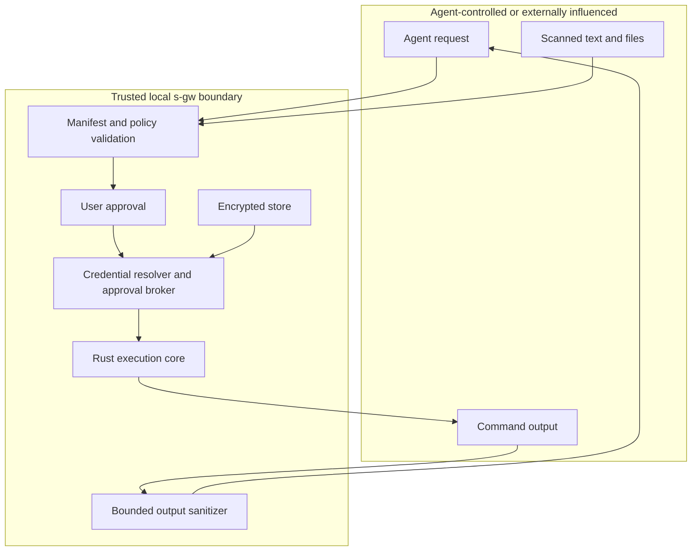

# Threat Model

## Purpose

s-gw reduces the chance that raw credentials are exposed to coding agents, model context, chat transcripts, tool results, or routine shell arguments. It keeps credential redemption and approval on the user's machine.

This document describes the intended security boundary for the current preview. It is not a claim of formal verification or independent audit.

## Protected Assets

- raw credential values and local unlock material;
- credential-store pointers and encrypted ledger contents;
- approval decisions and reusable-grant scope;
- command, environment, working-directory, and SSH destination policy;
- sanitized execution output and audit records.

## Trust Boundaries

The local operating system account, s-gw broker and Rust core processes, operating system credential store, approved executable, and user approval decision are trusted for an approved action. Agent input, scanned content, command arguments, destinations, and command output are treated as untrusted.

## Intended Guarantees

- Agent-facing interfaces use typed handles and metadata rather than raw values.
- A secret-backed action must match the handle's allowed command or owned SSH policy.
- Pending actions do not execute until a policy or local user decision approves them.
- Reusable approvals are bounded by stored request attributes and expiry or login session.
- Credential and unlock values entered through supported commands use stdin instead of process arguments.
- The loopback console requires a per-session token for state-changing operations.
- Known raw credential values are replaced in captured command output before it is returned to the caller.
- Approved environment commands run with a cleared child environment and only the allowlisted system variables plus approved credential bindings.
- The broker verifies that the Rust result contains no known raw credential and that its proof matches the request and sanitized output.
- Approval, execution, denial, failure, and policy activity is recorded locally.

## Attacker Capabilities Considered

- A coding agent may create arbitrary tool requests and misleading reasons.
- Repository content may contain prompt injection or request unsafe commands.
- A local web page may attempt to call the loopback console.
- A child process may print the injected credential in its output.
- An attacker may guess handles, request IDs, or local API routes.
- A request may be interrupted by process exit, sleep, or a hung command.

## Non-Goals And Residual Risk

s-gw does not protect against:

- compromise of the current operating system account, kernel, credential store, or s-gw process;
- a malicious or compromised executable that the user approves to receive a credential;
- screen capture, keylogging, debugger access, process-memory inspection, or privileged endpoint monitoring;
- network exfiltration performed by an approved command;
- every transformed, encoded, hashed, fragmented, or derived representation of a credential in output;
- secrets the user pastes directly into chat, source files, terminal commands, or agent configuration;
- credential access by tools that bypass s-gw entirely;
- broad prompt, file, terminal, or operating system interception solely through MCP registration;
- denial of service, destructive approved commands, or incorrect user approval decisions.

Output sanitization is a last line of defense, not a data-loss-prevention guarantee. Keep allowed commands narrow, review destinations and arguments, and use low-privilege credentials with independent provider-side controls.

## Secure Use

- Enroll credentials from a local terminal or supported UI, never from agent chat.
- Prefer macOS Keychain or Windows Credential Manager over environment-provided unlock material.
- Use absolute executable paths for command grants where practical.
- Keep reusable approvals short and scoped to one agent when possible.
- Treat unlimited approvals and high-severity credentials as exceptional.
- Review SSH destinations, ports, and remote commands before approval.
- Keep the operating system, Node.js, s-gw, and credential providers updated.
- Review the local audit log and revoke stale policies and grants.

## Reporting

Report suspected boundary failures through the private process in [SECURITY.md](../SECURITY.md). Do not test with credentials or systems you do not own or have permission to use.
